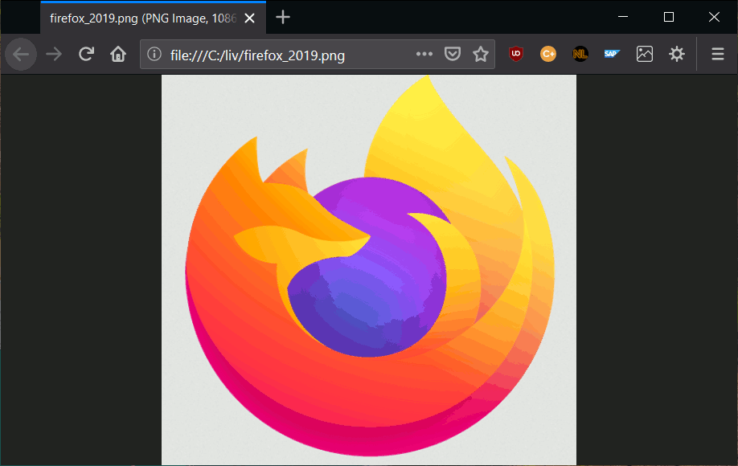

# Local Image Viewer

<!-- SHIELD IO BADGES INSTALL START -->

<!-- SHIELD IO BADGES INSTALL END -->

This Firefox Extension lets you navigate with the arrow keys to the previous/next local image like in a normal image viewer.
Images are pre-rendered and cached so you won't see any loading normally, the images are just there when you press the left/right arrow key.

